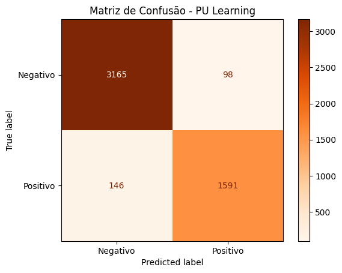

# Projeto de Rotulagem Fraca e Aprendizado com Rótulos Ruidosos no Dataset IMDB

## Introdução

Neste projeto, escolhi trabalhar com o dataset IMDB, que contém avaliações de filmes em inglês classificadas como positivas ou negativas. É um dataset clássico para problemas de análise de sentimentos, e sua popularidade ajuda a validar as técnicas aplicadas.

O objetivo principal foi experimentar técnicas de rotulagem fraca (weak supervision) para gerar rótulos automáticos com base em heurísticas simples, além de aplicar métodos para lidar com rótulos ruidosos, usando PU Learning e Cleanlab. A ideia era entender como essas técnicas ajudam a melhorar a qualidade dos modelos mesmo quando não temos rótulos manuais confiáveis para treinar.

## Técnicas Utilizadas

- **Rotulagem Fraca com Snorkel:** criei algumas labeling functions simples que procuram por palavras-chave no texto para sugerir se a avaliação é positiva ou negativa.
- **Modelagem de rótulos fracos com Snorkel LabelModel:** para combinar os votos das labeling functions e gerar um rótulo probabilístico para cada exemplo.
- **PU Learning (Positive-Unlabeled Learning):** usando a biblioteca `pulearn`, treinei um classificador para lidar com rótulos positivos e exemplos não rotulados.
- **Cleanlab:** para detectar e corrigir possíveis erros nos rótulos, melhorando o desempenho do classificador final.
- **TF-IDF:** para transformar o texto em vetores numéricos que podem ser usados nos classificadores tradicionais (Logistic Regression).

## Pipeline do Projeto

1. **Carregamento e preparação do dataset IMDB:** importei o dataset completo e criei um DataFrame com os textos.
2. **Definição das Labeling Functions:** defini funções simples que verificam a presença de palavras como "love", "hate", "excellent" e "boring".
3. **Aplicação das Labeling Functions:** usando o Snorkel para aplicar essas funções ao dataset, gerando a matriz de votos.
4. **Treinamento do LabelModel do Snorkel:** para combinar as saídas das labeling functions em rótulos fracos.
5. **Vetorização dos textos:** transformei os textos em vetores TF-IDF para usar em modelos de machine learning.
6. **Treinamento com PU Learning:** usando o `ElkanotoPuClassifier` para treinar um modelo que reconhece positivos e dados não rotulados.
7. **Treinamento com Cleanlab:** para melhorar o modelo identificando e corrigindo rótulos ruidosos.
8. **Divisão dos dados em treino e validação:** para avaliar os modelos com métricas como precisão, recall e F1-score.
9. **Análise dos resultados:** incluindo comparação entre rótulos fracos e verdadeiros, identificação de possíveis erros de anotação e visualização de métricas.
10. **Visualizações:** gráficos de cobertura das labeling functions, distribuição dos rótulos, e matrizes de confusão para entender melhor o desempenho.

## Resultados Obtidos

- As labeling functions simples conseguiram rotular uma boa parte dos dados, mas com limitações naturais (algumas funções tinham baixa cobertura).
- O modelo Snorkel LabelModel ajudou a combinar esses rótulos fracos e gerar uma sinalização mais confiável.
- PU Learning mostrou um bom desempenho ao lidar com dados parcialmente rotulados, alcançando alta precisão e recall.
- Cleanlab foi essencial para identificar erros nos rótulos e melhorar ainda mais a qualidade da classificação.
- As métricas indicam que, mesmo com rotulagem fraca e dados ruidosos, é possível treinar modelos que têm desempenho competitivo.

## Pacotes e Bibliotecas Utilizadas

- `datasets` (Hugging Face) — para carregar o dataset IMDB
- `pandas` — manipulação de dados
- `snorkel` — rotulagem fraca e combinação de rótulos
- `pulearn` — aprendizado com dados positivos e não rotulados (PU Learning)
- `scikit-learn` — vetorização TF-IDF, regressão logística, métricas e validação
- `cleanlab` — detecção e correção de rótulos ruidosos
- `matplotlib` — visualização gráfica
- `numpy` — manipulação numérica
- `joblib` — para salvar modelos (se aplicável)

- ## Visualizações e Gráficos

Durante o desenvolvimento do projeto, alguns gráficos importantes foram gerados para analisar os resultados e o desempenho dos modelos. A seguir, os principais gráficos:

### 1. Comparação de Métricas: PU Learning vs Cleanlab

Gráfico de barras comparando as métricas de precisão (Precision) e revocação (Recall) dos modelos baseados em PU Learning e Cleanlab para os rótulos "Negativo" e "Positivo".


---

### 2. Matriz de Confusão (CleanLab)

Essa matriz compara os rótulos verdadeiros com as predições do modelo treinado com CleanLab, ajudando a identificar erros de classificação.


---

### 3. Matriz de Confusão (PU Learning)

Mostra o desempenho do classificador baseado em PU Learning, comparando rótulos verdadeiros e predições feitas pelo modelo.



---

### 4. Cobertura das Labeling Functions (Snorkel)

Gráfico que apresenta a proporção de exemplos cobertos por cada Labeling Function utilizada para gerar os rótulos fracos, permitindo avaliar sua contribuição.


---

### 5. Distribuição dos Rótulos Fracos

Gráfico mostrando a quantidade de exemplos para cada tipo de rótulo fraco (positivo, negativo e abstain), evidenciando o balanceamento dos dados utilizados.


---

## Exportando Artefatos e Resultados

Durante o desenvolvimento, alguns arquivos importantes foram gerados e salvos na pasta `artefatos/`, permitindo que os modelos e métricas possam ser reutilizados futuramente sem a necessidade de reprocessamento:

- `vectorizer.joblib`: Vetorizador TF-IDF treinado.
- `classifier.joblib`: Classificador treinado com Cleanlab.
- `metricas_cleanlab.csv`: Métricas de avaliação salvas em formato CSV.

Esses arquivos podem ser carregados da seguinte forma:

```python
import joblib
import pandas as pd

# Carrega o vetorizador TF-IDF
vectorizer = joblib.load("artefatos/vectorizer.joblib")

# Carrega o classificador treinado
clf = joblib.load("artefatos/classifier.joblib")

# Carrega as métricas salvas
report_df = pd.read_csv("artefatos/metricas_cleanlab.csv", index_col=0)


---

